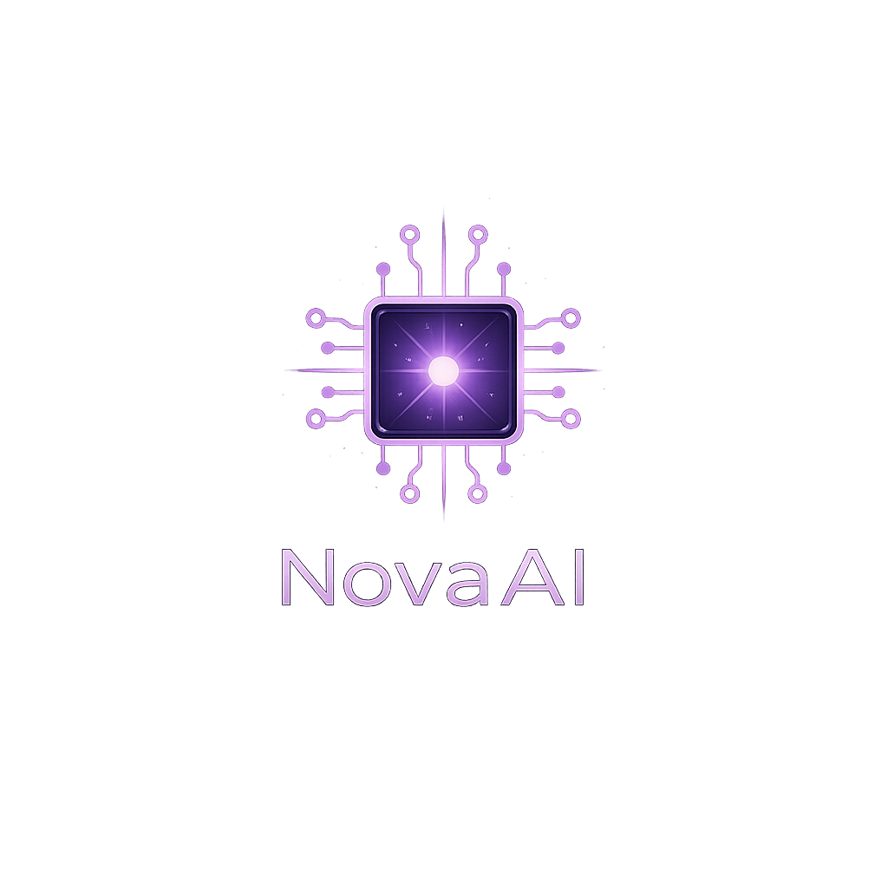

<div align="center">
  
</div>

# NovaAI

### *Your brutally honest AI companion that actually talks back.*

[](https://python.org)
[](LICENSE)
[](VERSION)
[](https://microsoft.com)

NovaAI is a voice-powered desktop companion built with Python. It listens through your mic, thinks with local or cloud LLMs, and speaks back with a cloned voice — all wrapped in a slick dark-themed UI.

Think Alexa, but with *attitude* and zero cloud lock-in. 🔥

---

## ✨ Features at a Glance

| | Feature | Details |
|---|---------|---------|
| 🧠 | **LLM Chat** | Ollama, OpenAI, OpenRouter, LM Studio, or the Claude/Codex CLI — your pick |
| 🎙️ | **Voice Input** | Local `faster-whisper` STT — no audio leaves your machine |
| 🔊 | **Voice Output** | XTTS-v2 streamed synthesis with cloned voices (or Google TTS lite) |
| 💜 | **Twitch Chat** | Reads your stream chat and replies in-character — Neuro-sama style |
| 🎉 | **Stream Alerts & Tips** | Reacts to donations/follows/subs/raids with an expression + cute message, and a tips ("stockings") OBS overlay |
| 🧬 | **Memory / Learning** | RAG long-term memory — remembers facts across sessions and gets better |
| 🧍 | **VRM Avatar** | 3D avatar that lip-syncs, emotes (20+), idles, dances, and plays **MMD** motions — OBS-ready |
| 🎮 | **Game Playing** | Autonomously plays Minecraft (Mineflayer) + a universal vision driver |
| 🎤 | **Singing** | Sings songs in its own voice over an auto-found YouTube instrumental |
| 🌐 | **Web Search** | Manual or auto-triggered lookups via SearXNG / DuckDuckGo |
| 🎵 | **Music & Radio** | SoundCloud search, internet radio, in-app playback |
| ⏰ | **Reminders & Alarms** | Natural language: *"remind me to call mum at 3pm"* |
| 🕐 | **Date & Time** | Answers *"what time/day/date is it"* instantly (no LLM round-trip) |
| 📋 | **To-Do & Shopping** | Checkbox lists that sync across voice and GUI |
| 📅 | **Calendar** | Track events with dates and times |
| 👤 | **Profiles** | Multiple companion personalities — create, clone, switch, import/export, delete |
| ⚡ | **Auto-Tune** | Detects your hardware, adjusts models and GPU usage |
| 🔄 | **Self-Update** | Checks GitHub for new versions on startup |
| 🗄️ | **SQLite Storage** | Everything in one clean database — no scattered JSON |

---

## 🚀 Quick Start

### ⚡ One-Line Install (fresh machine)

**Windows** — open PowerShell and paste:

```powershell
powershell -c "irm https://raw.githubusercontent.com/cachenetworks/NovaAI/main/install.ps1 | iex"
```

**Linux** — open a terminal and paste:

```bash
curl -fsSL https://raw.githubusercontent.com/cachenetworks/NovaAI/main/install.sh | bash
```

> Both installers handle **everything** — Python, LLM provider choice (Ollama, OpenAI, OpenRouter, LM Studio, or any custom endpoint), model downloads, NVIDIA GPU setup, desktop shortcut/launcher — the works. Just answer a few questions and sit back.

### 🔧 Already have the repo?

```bash
python setup.py          # or python3 on Linux
```

First run does the full setup, then launches the GUI (or the browser web UI on a
headless machine). Subsequent runs skip straight to launch.

### 📋 All commands

```bash
python setup.py              # Setup (if needed) + launch (GUI, or web UI if headless)
python setup.py --launch     # 🖥️ Launch desktop GUI
python setup.py --web        # 🌐 Launch headless browser web UI (great for a Pi/server)
python setup.py --terminal   # ⌨️ Terminal mode
python setup.py --setup      # 🔧 Re-run setup only
python setup.py --update     # 🔄 Check for updates

python app.py --web          # 🌐 Same web UI, started directly (0.0.0.0:8800)
```

---

## 🌐 Network Access (web mode)

In **`--web`** mode NovaAI is meant to be reached from other devices, so the web UI **and** its sibling services bind to **all interfaces** — reachable over your LAN, **Tailscale**, a reverse proxy, or a Cloudflare tunnel:

| Service | Port | Notes |
|---------|------|-------|
| 🖥️ Web dashboard | `8800` | `NOVA_WEB_HOST` / `NOVA_WEB_PORT` |
| 🧍 Avatar overlay (HTTP + WebSocket) | `8766` / `8765` | for OBS / browser overlays |
| 🎮 Minecraft Live View | `8768` | 3D world + inventory + thoughts |

Just open the dashboard at e.g. `http://192.168.1.107:8800/` (or your Tailscale IP). When you open the **Avatar** window or **Live View**, NovaAI opens a **new browser tab on the same host you're using** (`192.168.1.107:8766`, `:8768`, …) — it never launches a browser on the Pi itself.

- 🎬 **OBS Browser Sources:** add the **avatar** at `http://<host>:8766/?transparent=1` (transparent — shows *only* the avatar) and the **tips overlay** at `http://<host>:8800/overlay/earnings`.
- 🖥️ The **desktop GUI** (`--gui`) is a local app, so these services stay bound to **`127.0.0.1`** (localhost only).
- 🔒 To restrict a service in web mode, set its host: `NOVA_BIND_HOST` (all services), or per-service `NOVA_AVATAR_HOST` / `MC_VIEWER_HOST` (e.g. `127.0.0.1`).
- ☁️ **Cloudflare tunnel:** the tab uses whatever host you browsed from, with the service port appended — expose those ports on that hostname in your tunnel config.

> ⚠️ These services have **no authentication**, so binding to all interfaces exposes them to everyone on your LAN / tailnet. That's usually fine on a trusted network; lock them down with the host overrides above if not.

---

## 🖥️ The Desktop GUI

NovaAI runs as a native desktop window powered by **pywebview + Tailwind CSS** — a proper web-rendered UI that looks and feels modern, not some grey widget nightmare.

| Page | What It Does |
|------|-------------|
| 📊 **Dashboard** | Session controls, toggle voice/mic/hands-free, live status |
| 💬 **Chat** | Full conversation view with text + voice input |
| 🔔 **Reminders** | Time-based reminders and recurring alarms |
| 📅 **Calendar** | Events with date/time tracking |
| 🛒 **Shopping** | Checkbox shopping list |
| ✅ **To-Do** | Task list with done/delete |
| 💜 **Stream** | Connect Twitch chat, watch the live feed, set the reply mode + who can talk (everyone / subscribers / moderators) |
| 🧍 **Avatar** | Upload a VRM, open the OBS window, test emotions, toggle lip-sync |
| 💃 **MMD** | Add dances (motion + song + camera bundled per row), play on the avatar, delete |
| 🎮 **Game** | Pick a driver (Minecraft/universal/etc.), set a goal, watch the live view |
| 🎤 **Sing** | Type a song, attach/auto-find a backing track, replay saved songs |
| 👤 **Profiles** | Create, clone, switch, delete, or import/export personalities |
| ⚙️ **Settings** | Audio devices, web search, LLM/TTS/STT config |

> 💡 **Pro tip:** Voice replies, hands-free mode, and mic mute can all be toggled *before* starting a session. Configure everything first, then hit Start.

---

## 💜 Neuro-sama Mode

NovaAI can do far more than chat — it can stream, learn, embody a 3D avatar, play games, and sing. Everything below is **local-first** and tuned to run on a modest 6–8GB GPU (with cloud/CLI fallbacks where it matters).

### 💜 Twitch Chat

Reads your channel's chat and replies **in-character**, just like Neuro-sama. Works anonymously (read-only) or, with a bot token, posts replies straight back into chat.

- Reply policy: **mention** (answer when named), **command** (only `!ask ...`), or **all** (answer everything) — with a cooldown so it never spams or swamps the GPU
- **Who can talk to NovaAI**: `everyone`, `subscribers` (subs/VIPs/mods/broadcaster), or `moderators` (mods/broadcaster) — all chat still shows in the feed
- Live chat feed + connection status on the **Stream** page; replies also speak aloud (OBS-capturable) and lip-sync the avatar
- Set it up with `TWITCH_ENABLED`, `TWITCH_CHANNEL`, and (optional) `TWITCH_BOT_USERNAME` + `TWITCH_OAUTH_TOKEN`

### 🎉 Stream Alerts & Tips ("Stockings")

NovaAI reacts to **donations, follows, subs, resubs, gift subs, cheers, raids, and hosts** with an avatar expression + a cute, **profile-flavored** spoken message — then tallies the money on a tips overlay.

- **Sources**: Streamlabs & StreamElements (enter the tokens in **Settings → Stream Alerts** or via `STREAMLABS_SOCKET_TOKEN` / `STREAMELEMENTS_JWT_TOKEN`, plus `pip install -r requirements-streaming.txt`), or a universal **webhook** so **Twitch EventSub, Tangia, sound-alert tools, or any bot** can drive reactions:
  ```bash
  curl -X POST "http://<host>:8800/webhook/stream?source=webhook" \
       -H "Content-Type: application/json" \
       -d '{"type":"donation","user":"Alice","amount":5,"currency":"USD"}'
  ```
  (Set `NOVA_WEBHOOK_SECRET` to require an `X-Nova-Secret` header / `?secret=`.)
- **Reactions** are editable per profile (`profile_details.alerts`): a cute message + expression per event type. Placeholders: `{user} {amount} {currency} {months} {tier} {viewers} {message}`.
- **Tips overlay** ("stockings"): an OBS-ready transparent page at **`/overlay/earnings`** showing all-time / today / session totals (try `?show=today`, `?title=Goal&goal=500`). Bits convert at 100 = ~$1.
- **Test** any reaction without a live event from the **Stream** page buttons.

### 🧬 Memory / Learning (RAG)

NovaAI **remembers across sessions** using retrieval-augmented memory — not fine-tuning. Tell it a fact today, ask for it next week, and it recalls it.

- Local **sentence-transformers** embeddings on CPU by default (keeps VRAM free for the LLM); Ollama or OpenAI embedding backends optional
- Stored in the same SQLite DB; thumbs-up/down reinforces or de-weights memories, and stale/low-score ones are pruned automatically
- Configure with `RAG_ENABLED`, `RAG_EMBEDDING_PROVIDER`, `RAG_EMBEDDING_MODEL`, `RAG_TOP_K`

### 🧍 VRM Avatar

A real 3D avatar (three-vrm) that **lip-syncs to the voice**, changes expression with the mood, breathes/blinks on idle, and even dances.

- Upload any **`.vrm`** model from the **Avatar** page
- **20+ expressions** with matching body language — happy, excited, laugh, proud, smug, **blush, shy, love, flirty, wink**, sad, cry, pout, angry, anxious, scared, surprised, shocked, confused, relaxed, calm, sleepy, and **sleeping** (lies down with eyes closed) — plus visemes driven from live TTS amplitude
- Custom expressions like **blush / wink / love** use the model's own blendshapes when present, and gracefully fall back to a matching preset + pose otherwise
- Expressions are auto-picked from the mood of each reply, or test them from the **Avatar** page buttons
- **OBS-ready**: open the transparent browser window as a Browser Source for streaming
- Shared lip-sync seam means chat, Twitch replies, game narration, and singing **all** animate it

### 💃 MMD Dances

Play **MMD (`.vmd`) dance motions on your VRM avatar** — with optional audio and an optional camera motion.

- **Add a dance** from the dedicated **MMD** page (sidebar): each dance is one bundle — a `.vmd` **motion** (required) + an optional **song** (`.mp3`/`.wav`/`.ogg`/`.m4a`) + an optional `.vmd` **camera**, uploaded together and shown as a single row with **Play** and **Delete**. Saved under `data/mmd/sets/`.
- Pick motion + audio + camera, hit **Play Dance** (with optional **Loop**) and it retargets the MMD motion onto the VRM humanoid, syncs the audio, and (if provided) drives the camera. **Stop** returns to idle.
- Works in the OBS overlay too (`?transparent=1`).

> ⚙️ MMD→VRM retargeting is best-effort (unlike native MMD players such as [web-mmd](https://github.com/culdo/web-mmd), which drive real PMX rigs). The torso/upper body, head, and hands track well. Open the **non-transparent** overlay (`http://<host>:8766/`) to get a live **MMD body tuning** panel — flip the facing/axis (0–3), knee bend, leg-IK, and arm-down amount and watch the dance fix itself; the choice saves automatically.

> 🐞 **Known bug — leg tracking (MMD on VRM):** the **legs don't track reliably yet**. MMD dances move the legs through foot **IK target** bones (足ＩＫ) rather than direct leg rotations, and reproducing that on a VRM skeleton (whose leg rig/rest pose differs from MMD) still needs work — the correct source/approach for the leg solve is unresolved. **Body, torso, head, arms and hands are trackable**; legs/feet may look stiff, slide, or bend oddly. Toggle **Leg IK off** in the tuning panel to fall back to raw leg motion. Help/PRs welcome (see [SystemAnimatorOnline](https://github.com/ButzYung/SystemAnimatorOnline) for a reference VMD-on-VRM implementation).

### 🎮 Game Playing

NovaAI autonomously plays games, narrating its thoughts aloud (in chat, voice, avatar, and stream) as it goes.

- **Minecraft** via a Mineflayer Node bridge: mine, build, craft, smelt, farm crops/trees with bone meal, fish, breed animals, trade villagers, fight mobs, follow/help whitelisted players, auto-equip better tools
- **Live View**: a fancy green dashboard serving the 3D world (prismarine-viewer) + live inventory + the bot's thoughts + server chat on **one port**
- **Universal driver**: a vision+input agent (set a `VISION_MODEL`) for TOS-safe single-player games; plus **VRChat** (OSC), **Factorio** (RCON), and offline-only **osu!**
- Per-game settings live in the **Game** panel — no `.env` editing to switch servers. Requires Node.js 18+ and `npm install` in `node/minecraft-bridge`

### 🎤 Singing

NovaAI sings songs in its **own cloned voice**, on the beat, over a real instrumental.

- Type `Artist - Title` → it fetches **timed lyrics** (LRCLIB) and performs them
- Backing track is optional: attach a **file**, paste a **YouTube URL**, or leave it blank to **auto-find an instrumental** on YouTube
- **Vocals + backing are merged into one audio file**, saved in `audio/songs/` for instant replay
- Works with **XTTS** (timed, on-beat) or **gTTS**. Needs `pip install yt-dlp imageio-ffmpeg` for the YouTube/merge features

---

## ⌨️ Terminal Commands

For the keyboard warriors out there:

<details>
<summary>📖 Click to expand full command list</summary>

### 🗣️ Voice & Input

| Command | What It Does |
|---------|-------------|
| `/mode voice` | Hands-free mic input |
| `/mode text` | Switch back to typing |
| `/listen` or `/ask` | Capture one spoken turn |
| `/voice` | Toggle spoken replies on/off |
| `/recalibrate` | Re-tune mic noise gate |
| `/mics` | List available microphones |
| `/mic <index>` | Choose a specific mic |
| `/mic default` | Reset to system default |
| `/speakers` | List XTTS voices |
| `/speaker <name>` | Switch XTTS voice |
| `/tts` | Show current TTS provider |
| `/tts xtts` / `/tts gtts` | Switch TTS engine |

### 🌐 Web Search

| Command | What It Does |
|---------|-------------|
| `/web` | Show web search status |
| `/web on` / `/web off` | Enable/disable web search |
| `/web auto on` / `/web auto off` | Toggle auto-search for current events |
| `/web clear` | Clear queued web context |
| `/web <query>` | Search and feed results to next reply |

### 🎵 Media

| Command | What It Does |
|---------|-------------|
| `/play <query>` | Play a radio station or search music |
| `/radio <station>` | Tune into a known station |
| `/music <query>` | Search your default music platform |
| `/pause` / `/resume` / `/stop` | Playback controls |

### 👤 Profiles & History

| Command | What It Does |
|---------|-------------|
| `/profile` | Show current profile |
| `/profiles` | List all profiles |
| `/profile use <id>` | Switch profiles |
| `/name <new name>` | Rename the companion |
| `/me <name>` | Set your name |
| `/remember <fact>` | Store a memory note |
| `/reset` | Clear conversation history |
| `/performance` | Show hardware and tuning info |
| `/exit` | Quit |

</details>

> 🗣️ **Natural language works too!** Say *"remind me to call the dentist at 3pm"*, *"play Capital FM"*, or *"add milk to my shopping list"* — NovaAI handles it.

---

## 🎭 Profiles — Make It Yours

Each companion profile is deeply customisable. Go wild:

| Section | What You Can Tweak |
|---------|-------------------|
| 🏷️ **Identity** | Name, pronouns, role, relationship style |
| 💬 **Conversation** | Reply length, pacing, verbosity, formatting |
| 🎚️ **Personality Sliders** | Warmth, sass, directness, patience, playfulness, formality |
| 🚧 **Boundaries** | Roast intensity, avoided topics, safety overrides |
| 🧠 **Memory** | Likes, dislikes, personal facts, inside jokes, projects |
| 🔊 **Voice** | Speech style, delivery notes, persona keywords |
| 📜 **Custom Rules** | Hard must-follow rules and soft preferences |

Want a sarcastic best friend? A patient tutor? A no-nonsense project manager? Just create a new profile and dial the sliders. 🎛️

### 📤 Import / Export

Move a profile between machines (e.g. your **PC → Raspberry Pi**) from the **Profiles** page:

- **Export** — click **Export** on any profile to download a `*.nova-profile.json` file (saved to the device you're browsing from).
- **Import** — click **Import**, pick a `*.nova-profile.json` file, and it's added as a **new** profile (importing never overwrites an existing one).
- **Delete** — remove any non-active profile with **Delete** (you always keep at least one).

> 💡 The export file carries the whole profile — identity, sliders, memory notes, voice, and all feature data — so the imported copy behaves exactly like the original.

---

## 🗄️ Data Storage

All runtime data lives in a single **SQLite database** at `data/novaai.db`:

- 💬 Chat history
- 👤 Profiles and all their feature data (reminders, todos, shopping, calendar, alarms, alert messages)
- ⚙️ App state (active profile, settings, tips/earnings totals)

Binary assets live on disk: VRM models in `data/avatars/`, MMD dances in `data/mmd/`.

> 📦 On first run, existing JSON files (`profiles.json`, `history.jsonl`) are **automatically migrated** into the database. No manual steps needed.

---

## ⚙️ Configuration

Copy `.env.example` to `.env` and tweak what you need:

<details>
<summary>📖 Click to expand full configuration reference</summary>

### 🧠 Core

| Setting | Default | Description |
|---------|---------|-------------|
| `AUTO_TUNE_PERFORMANCE` | `true` | Auto-detect hardware and tune settings |
| `AUTO_TUNE_GOAL` | `balanced` | Tuning goal: `speed`, `balanced`, or `quality` |
| `AUTO_UPDATE_CHECK` | `true` | Check GitHub for updates on startup |
| `AUTO_UPDATE_INSTALL` | `true` | Auto-install updates for non-git installs |

### 🤖 LLM

| Setting | Default | Description |
|---------|---------|-------------|
| `LLM_PROVIDER` | `ollama` | Chat backend: `ollama`, `openai`, or `claude-code` / `codex` / `cli` (shell out to an already-logged-in Claude Code / Codex CLI — no API key) |
| `LLM_MODEL` / `OLLAMA_MODEL` | `dolphin3` | Which model to use |
| `LLM_API_URL` | *(auto)* | Chat endpoint URL — set automatically by the installer for your chosen provider |
| `LLM_API_KEY` | *(none)* | API key for cloud providers (OpenAI, OpenRouter, etc.) |
| `OLLAMA_SKIP_LOCAL_SETUP` | `false` | Set `true` when using an existing Ollama server endpoint instead of local install/start |
| `LLM_NUM_PREDICT` | `1200` | Reply token budget |
| `OLLAMA_NUM_CTX` | `0` | Context window sent to Ollama (`0` = Ollama default). Cap it (e.g. `4096`) so long-context models load on small GPUs |
| `LLM_TEMPERATURE` | `0.95` | Response creativity |

### 🌐 Web Search

| Setting | Default | Description |
|---------|---------|-------------|
| `WEB_BROWSING_ENABLED` | `true` | Enable web search features |
| `WEB_AUTO_SEARCH` | `false` | Auto-search for current-event questions |
| `WEB_SEARCH_PROVIDER` | `searxng` | Backend: `searxng` or `duckduckgo` |
| `WEB_SEARCH_URL` | *(built-in)* | SearXNG endpoint URL |
| `WEB_MAX_RESULTS` | `5` | Results per lookup |
| `WEB_SAFESEARCH` | `moderate` | Safe search: `off`, `moderate`, `strict` |

### 🎵 Media

| Setting | Default | Description |
|---------|---------|-------------|
| `MEDIA_REGION` | `GB` | Radio region (`GB`, `US`, `AU`, `CA`, etc.) |
| `MUSIC_PROVIDER_DEFAULT` | `soundcloud` | Default music platform |

### 🔊 Voice & TTS

| Setting | Default | Description |
|---------|---------|-------------|
| `VOICE_ENABLED` | `false` | Start with voice replies on |
| `TTS_PROVIDER` | `xtts` | Voice engine: `xtts` or `gtts` |
| `XTTS_SPEED` | `1.0` | Speaking pace multiplier |
| `XTTS_USE_GPU` | `true` | Use GPU for voice synthesis |
| `XTTS_STREAM_OUTPUT` | `true` | Stream audio while generating |
| `XTTS_SPEAKER` | `Ana Florence` | XTTS voice name |

### 🎙️ Speech-to-Text

| Setting | Default | Description |
|---------|---------|-------------|
| `STT_PROVIDER` | `faster-whisper` | STT engine |
| `STT_MODEL` | `small.en` | Whisper model size |
| `STT_USE_GPU` | `true` | Use GPU for transcription |
| `INPUT_MODE` | `voice` | Default input: `voice` or `text` |

### 🔈 Audio Devices

| Setting | Default | Description |
|---------|---------|-------------|
| `MIC_DEVICE_INDEX` | *(auto)* | Pin a specific microphone |
| `SPEAKER_DEVICE_INDEX` | *(auto)* | Pin a specific speaker |

### 💜 Twitch

| Setting | Default | Description |
|---------|---------|-------------|
| `TWITCH_ENABLED` | `false` | Enable Twitch chat reading/replies |
| `TWITCH_CHANNEL` | *(none)* | Channel to read (no leading `#`) |
| `TWITCH_BOT_USERNAME` | *(none)* | Bot account name (blank = anonymous read-only) |
| `TWITCH_OAUTH_TOKEN` | *(none)* | `oauth:...` token so it can post replies |
| `TWITCH_REPLY_MODE` | `mention` | `mention`, `command` (`!ask`), or `all` |
| `TWITCH_ALLOWED_ROLES` | `everyone` | Who NovaAI replies to: `everyone`, `subscribers` (subs/VIPs/mods/broadcaster), or `moderators` (mods/broadcaster). All chat still shows in the feed. |
| `TWITCH_REPLY_COOLDOWN` | `8` | Seconds between replies |

### 🎉 Stream Alerts

| Setting | Default | Description |
|---------|---------|-------------|
| `STREAMLABS_SOCKET_TOKEN` | *(none)* | Streamlabs socket API token for live alerts (needs `requirements-streaming.txt`) |
| `STREAMELEMENTS_JWT_TOKEN` | *(none)* | StreamElements JWT for live alerts (needs `requirements-streaming.txt`) |
| `NOVA_WEBHOOK_SECRET` | *(none)* | If set, `/webhook/stream` requires `X-Nova-Secret` header or `?secret=` |

### 🧬 RAG Memory

| Setting | Default | Description |
|---------|---------|-------------|
| `RAG_ENABLED` | `true` | Remember facts across sessions |
| `RAG_EMBEDDING_PROVIDER` | `local` | `local` (CPU MiniLM), `ollama`, or `openai` |
| `RAG_EMBEDDING_MODEL` | `all-MiniLM-L6-v2` | Embedding model id |
| `RAG_TOP_K` | `4` | How many memories to recall per reply |

### 🎮 Game Playing

| Setting | Default | Description |
|---------|---------|-------------|
| `GAME_ENABLED` | `false` | Enable the game agent |
| `GAME_DRIVER` | `minecraft` | `minecraft`, `universal`, `vrchat`, `factorio`, or `osu` |
| `MC_HOST` / `MC_PORT` | `127.0.0.1` / `25565` | Minecraft server address |
| `MC_USERNAME` / `MC_AUTH` | `NovaAI` / `offline` | Bot name + `offline` or `microsoft` auth |
| `MC_VIEWER_PORT` | `8768` | Live View dashboard port (3D + inventory) |
| `MC_VIEWER_HOST` | *(follows mode)* | Live View bind host — all interfaces in web mode, `127.0.0.1` in GUI |
| `VISION_MODEL` | *(none)* | Multimodal model for the universal driver |

### 🌐 Networking

| Setting | Default | Description |
|---------|---------|-------------|
| `NOVA_WEB_HOST` / `NOVA_WEB_PORT` | `0.0.0.0` / `8800` | Web dashboard bind host + port |
| `NOVA_BIND_HOST` | *(follows mode)* | Bind host for sibling services (avatar, Live View). Web mode → `0.0.0.0`, GUI → `127.0.0.1` |
| `NOVA_AVATAR_HOST` | *(follows `NOVA_BIND_HOST`)* | Avatar HTTP/WebSocket bind host override |
| `MC_VIEWER_HOST` | *(follows `NOVA_BIND_HOST`)* | Minecraft Live View bind host override |

### 🎤 Singing

| Setting | Default | Description |
|---------|---------|-------------|
| `SINGING_ENABLED` | `true` | Enable singing |
| `SINGING_BACKEND` | `local` | `local` (XTTS/gTTS), `rvc`, or `cloud` |
| `SINGING_FETCH_INSTRUMENTAL` | `true` | Auto-find a YouTube instrumental when no backing is given |

</details>

---

## 📁 Project Layout

```
NovaAI/
├── app.py                    # 🚪 Entry point
├── setup.py                  # 🔧 Setup, launch, and update — all in one
├── install.ps1               # ⚡ One-line PowerShell installer (Windows)
├── install.sh                # 🐧 One-line bash installer (Linux)
├── requirements.txt          # 📦 Python dependencies (base)
├── requirements-voice.txt    # 🎙️ Optional: mic/STT/TTS/embeddings
├── requirements-gui.txt      # 🖥️ Optional: native pywebview desktop window
├── requirements-streaming.txt# 🎉 Optional: Streamlabs/StreamElements live alerts
├── VERSION                   # 🏷️ Current version
├── .env.example              # ⚙️ Configuration template
│
├── data/
│   ├── logo.png              # 🎨 NovaAI logo
│   ├── logo.ico              # 🎨 Window icon
│   ├── novaai.db             # 🗄️ SQLite database (runtime)
│   ├── avatars/              # 🧍 Uploaded VRM models
│   ├── mmd/                  # 💃 MMD assets (motion/ audio/ camera/)
│   └── profile.example.json  # 📝 Example profile
│
└── novaai/
    ├── launcher.py           # 🚪 CLI vs GUI vs web routing + auto-update
    ├── webgui.py             # 🖥️ Backend API (shared by desktop GUI + web)
    ├── webserver.py          # 🌐 Headless web UI server (--web) + webhook
    ├── cli.py                # ⌨️ Terminal chat loop + commands
    ├── chat.py               # 🧠 System prompt + LLM requests
    ├── engine.py             # 🧩 Shared reply seam + emotion detection
    ├── twitch.py             # 💜 Twitch IRC chat client (+ role parsing)
    ├── stream_events.py      # 🎉 Unified stream-event model + reactions
    ├── stream_sources.py     # 🔌 Streamlabs/StreamElements socket clients
    ├── memory.py             # 🧬 RAG long-term memory store
    ├── avatar.py             # 🧍 VRM avatar bridge (WebSocket + HTTP + MMD)
    ├── singing.py            # 🎤 Singing engine (XTTS/gTTS + backing merge)
    ├── games/                # 🎮 Game agent + drivers (minecraft/universal/…)
    ├── config.py             # ⚙️ Environment parsing + runtime config
    ├── database.py           # 🗄️ SQLite schema + CRUD operations
    ├── storage.py            # 💾 Profile/history API (SQLite-backed)
    ├── features.py           # ⏰ Date/time, reminders, alarms, todos, shopping, calendar
    ├── audio_input.py        # 🎙️ Mic capture + faster-whisper STT
    ├── tts.py                # 🔊 XTTS-v2 / gTTS synthesis + playback + lip-sync
    ├── media.py              # 🎵 Radio + music platform integration
    ├── media_player.py       # ▶️ In-app audio playback (ffplay)
    ├── performance.py        # ⚡ Hardware detection + auto-tuning
    ├── updater.py            # 🔄 GitHub version check + self-update
    ├── web_search.py         # 🌐 SearXNG / DuckDuckGo search
    ├── defaults.py           # 📋 Default profile template
    ├── models.py             # 📦 Shared dataclasses
    ├── paths.py              # 📍 Path constants
    └── static/
        ├── index.html        # 🎨 Tailwind CSS frontend (dashboard)
        ├── avatar.html       # 🧍 three-vrm avatar renderer + MMD (OBS source)
        └── earnings.html     # 🎉 Tips ("stockings") overlay (OBS source)

node/
└── minecraft-bridge/         # 🎮 Mineflayer Node bridge (modular lib/)
```

---

## 📚 Documentation

<details>
<summary>🧠 How the Chat Pipeline Works</summary>

When you send a message (text or voice), NovaAI runs through this pipeline:

1. **Media check** — is it a play/radio/music request? Handle it directly.
2. **Feature check** — is it a reminder, alarm, todo, shopping, or calendar request? Parse and handle.
3. **Web search** — if enabled, check for explicit `/web` queries, inferred lookups (*"what's the weather?"*), or auto-search triggers.
4. **Memory recall** — if RAG is enabled, retrieve relevant long-term memories and inject them as context.
5. **LLM request** — build a system prompt from the active profile, attach conversation history, web context, and recalled memories, send to the LLM.
6. **Voice output** — if voice is enabled, synthesise the reply with XTTS-v2 or gTTS, play it back, and drive the avatar's lip-sync.
7. **Remember** — store the exchange back into RAG memory for future recall.
8. **Hands-free loop** — if hands-free mode is on, immediately start listening for the next turn.

A shared generation seam (`engine.py`) means Twitch chat and the game agent reuse this exact pipeline. The whole thing runs in a background thread so the UI stays responsive.

</details>

<details>
<summary>🎙️ Voice & Audio Architecture</summary>

### Speech-to-Text (STT)
- Engine: `faster-whisper` (local) or Google Web Speech API
- Mic capture via `SpeechRecognition` library
- Automatic noise calibration on first listen
- Configurable silence detection, energy threshold, and VAD

### Text-to-Speech (TTS)
- **XTTS-v2** (default): local neural TTS with voice cloning, GPU-accelerated, streamed output
- **gTTS** (fallback): Google's cloud TTS — lightweight but needs internet
- Audio saved to `audio/latest_reply.wav` (XTTS) or `.mp3` (gTTS)
- Playback via `sounddevice` with configurable output device

### Audio Devices
- Mic and speaker can be pinned via `.env` or the Settings page
- `/mics` and `/speakers` commands list available devices with indices
- Recalibration re-tunes the noise gate without restarting

</details>

<details>
<summary>🗄️ Database Schema</summary>

NovaAI uses SQLite (`data/novaai.db`) with three tables:

**`profiles`** — one row per companion profile
```sql
profile_id   TEXT PRIMARY KEY   -- e.g. "default", "snarky-bot"
profile_name TEXT               -- display name
data         TEXT               -- full profile JSON blob
created_at   TEXT               -- ISO timestamp
updated_at   TEXT               -- ISO timestamp
```

**`history`** — one row per chat message
```sql
id        INTEGER PRIMARY KEY AUTOINCREMENT
timestamp TEXT                -- ISO timestamp
role      TEXT                -- "user", "assistant", or "system"
content   TEXT                -- message text
```

**`app_state`** — key/value settings store
```sql
key   TEXT PRIMARY KEY        -- e.g. "active_profile_id"
value TEXT                    -- the value
```

Feature data (reminders, alarms, todos, shopping, calendar) lives inside the profile JSON blob under `profile_details`, so it's saved/loaded with the profile automatically.

</details>

<details>
<summary>⚡ Performance Auto-Tuning</summary>

When `AUTO_TUNE_PERFORMANCE=true`, NovaAI detects your hardware at startup and picks a performance profile:

| What It Checks | What It Adjusts |
|----------------|----------------|
| CPU core count | Request timeouts |
| Available RAM | Token budget |
| CUDA GPU presence | TTS/STT GPU acceleration |
| VRAM amount | Whisper model size, XTTS streaming settings |

**Tuning goals:**
- `speed` — smaller models, aggressive timeouts, prioritise response time
- `balanced` — sensible defaults for most hardware
- `quality` — larger models, longer timeouts, prioritise output quality

> ⚠️ Auto-tune **never** changes `XTTS_SPEED`, so your companion's voice pace stays consistent across machines.

</details>

<details>
<summary>🔄 Auto-Update System</summary>

NovaAI can check for and install updates from GitHub:

1. On startup, compares local `VERSION` to the remote `VERSION` on your configured branch
2. If a newer version exists and `AUTO_UPDATE_INSTALL=true`, downloads and applies the update
3. Restarts itself with the new code

**Safety guards:**
- Git checkouts with local edits are **never** auto-updated
- Update results are cached for `AUTO_UPDATE_CACHE_SECONDS` (default: 6 hours) to avoid hammering GitHub
- Manual updates always available via `python setup.py --update`

</details>

<details>
<summary>🎵 Media & Radio</summary>

NovaAI intercepts natural media requests:

- *"play Capital FM"* → finds and streams the radio station
- *"play synthwave on SoundCloud"* → searches and plays a track
- *"pause"* / *"resume"* / *"stop"* → controls the current stream

**Supported radio regions:** UK, US, Australia, Canada, Germany, Japan (with fallback to internet-radio.com search)

**Music platforms:** SoundCloud (default), with Spotify and Deezer as search options

In-app playback uses `ffplay` for radio streams and resolved audio URLs.

</details>

---

## 💡 Good to Know

- 📥 **First run downloads models** — XTTS-v2 and faster-whisper grab model files on first use. `python setup.py` preloads them so you're not waiting forever.
- 🔇 **Mic mute is app-level** — it stops NovaAI from listening. It doesn't touch your Windows system mic.
- 🔒 **Git-safe updates** — if NovaAI detects a git checkout with local edits, self-update is skipped to protect your work.
- 💾 **Audio is always saved** — voice replies land in `audio/latest_reply.wav` even if playback fails. Useful for debugging.
- 🌍 **Works offline** — with Ollama and XTTS, the entire pipeline runs locally. Web search is optional.

---

## 🤝 Contributing

The codebase is modular by design — pick an area and dive in:

| Area | File(s) | Difficulty |
|------|---------|-----------|
| 🎙️ Voice / mic issues | `novaai/audio_input.py` | Medium |
| 🧠 Personality / responses | `novaai/chat.py` | Easy |
| 🔊 TTS / playback | `novaai/tts.py` | Medium |
| ⌨️ Commands / app flow | `novaai/cli.py` | Easy |
| 🎨 GUI frontend | `novaai/static/index.html` | Easy |
| 🖥️ GUI backend | `novaai/webgui.py` | Medium |
| ⏰ Features (reminders etc.) | `novaai/features.py` | Easy |
| 🗄️ Data / profiles | `novaai/storage.py` + `novaai/database.py` | Medium |
| 🌐 Web search | `novaai/web_search.py` | Medium |
| 🎵 Media / radio | `novaai/media.py` | Medium |
| 💜 Twitch chat | `novaai/twitch.py` | Medium |
| 🧬 RAG memory | `novaai/memory.py` | Medium |
| 🧍 VRM avatar | `novaai/avatar.py` + `novaai/static/avatar.html` | Hard |
| 🎮 Game agent / drivers | `novaai/games/` + `node/minecraft-bridge/` | Hard |
| 🎤 Singing | `novaai/singing.py` | Medium |

PRs welcome! If you're not sure where to start, open an issue and we'll point you in the right direction. 🫡

---

## 🐧 Linux & Raspberry Pi Support

> NovaAI runs on **Windows**, **amd64 Linux**, and **ARM64 / Raspberry Pi 5**.

### Install profiles

Voice and the native desktop GUI are now **optional add-ons**, so a headless box
installs only what it needs. `install.sh` asks which profile you want; you can also
pick manually:

| Profile | Installs | Good for |
|---|---|---|
| **Minimal** | `requirements.txt` | Text chat + **browser web UI**. Smallest, ARM-friendly. Recommended for a Pi. |
| **+ Voice** | `+ requirements-voice.txt` | Mic, speech-to-text, XTTS/gTTS, embeddings, singing (large; needs a mic/speakers). |
| **+ Desktop GUI** | `+ requirements-gui.txt` | The native pywebview window (needs a display). |
| **Everything** | all three | A full desktop machine. |

```bash
pip install -r requirements.txt                          # minimal (text + web UI)
pip install -r requirements.txt -r requirements-voice.txt # add voice/ML
pip install -r requirements.txt -r requirements-gui.txt   # add the desktop GUI
```

> The desktop GUI's CEF backend is Windows-only; on Linux/ARM `requirements-gui.txt`
> uses your system WebView instead (`gir1.2-webkit2-4.1` on Debian/Ubuntu).

### 🍓 Raspberry Pi 5 / headless quick-start

A Pi (or any server) usually has no monitor, mic, or speakers — so run the **browser
web UI** and reach Nova from another device:

```bash
git clone https://github.com/cachenetworks/NovaAI && cd NovaAI
python3 setup.py --setup        # choose the "Minimal" profile when asked
sudo apt install ffmpeg         # optional, for audio playback later
python3 app.py --web            # serves the UI on 0.0.0.0:8800
```

Then open `http://<pi-ip>:8800` in any browser on your network. Prefer the terminal?
`python3 app.py` gives you the same companion as a text chat over SSH.

- Host/port are configurable: `NOVA_WEB_HOST` / `NOVA_WEB_PORT` (default `0.0.0.0:8800`).
- On a box with no audio hardware, keep `VOICE_ENABLED=false` (the default) and set
  `INPUT_MODE=text` in `.env` so the terminal mode never reaches for a microphone.
- Voice can be added later — `pip install -r requirements-voice.txt` — once you attach
  a mic/speakers. XTTS runs on CPU there, so expect it to be slow.

### ✅ Done

- [x] **Minimal install runs without torch/coqui/PortAudio** — voice/ML imports are lazy
- [x] **`python app.py --web`** — headless browser UI (no display/pywebview needed)
- [x] **ARM64 / Raspberry Pi 5** — `pip install` no longer pulls Windows-only `cefpython3`
- [x] **`install.sh`** — arch/distro-aware system deps, install-profile prompt, headless detection
- [x] **`novaai/tts.py`** — Linux audio playback via ffplay, ALSA/PulseAudio/PipeWire/JACK support

### 🗺️ Roadmap

- [ ] **Fix MMD leg tracking on VRM** (foot-IK retarget) — body/arms/hands already track; legs are the open problem
- [ ] systemd service / auto-start on boot for the web UI
- [ ] Test on more distros (Fedora, Arch, NixOS)
- [ ] macOS support

---

## 📄 License

MIT License — see [LICENSE](LICENSE).

---

<div align="center">

Built with spite, sarcasm, and way too much caffeine ☕ by [CacheNetworks](https://github.com/cachenetworks)

**If NovaAI roasts you, that's a feature, not a bug.** 😏

</div>
